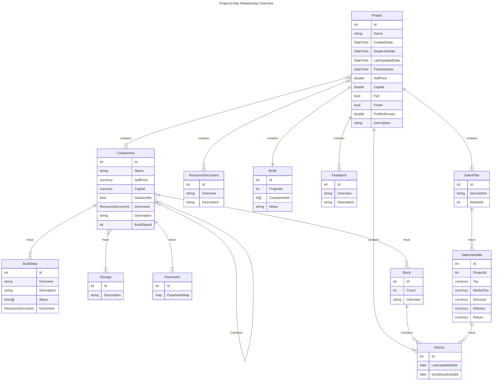

# Introduction 

## Planning 
- Create Project 
- Market Existance 
- Possible Profit 
- Needed Capital 
- Delivery Component 

## Purchase 
- BOM 
- Initial Price 
- Warehouse Insert 

## Project Management 
- Version Control Project 
- Project Documentation 

## Build 
- Build Step 
- Count How Much Able to Build

## Sales Planning 
- Sales Description 
- Store Outlet (Market)
- Store Tax or Promo Cut Price 
- Product Packaging and Delivery 
- Income Presentage 
- Cost Of Good 

## Sales Management 
- Customer Feedback 
- Market Price Change 

## Report
- Sell Product Report 
- Income And Capital
- Monthly / Weekly Report 

## History
- Component / Stock / Price History 
- Sell History 
- Money History 

# Entity Diagram Overview

