# 🏑 Introduction

ASP.NET Identity Custom Store Implementation, this repo contain of custom `RoleStoreBase`, and `UserStoreBase`, including extension to simplify registering needed service into builder `AddStandardCustomIdentityStores`.
basically we implementing _Data Access Layer_ as shown in this image. 

**Basic Inheritance on ASP.NET Identity**

```mermaid
classDiagram

note for StandardRoleStore "📔 Custom Implementation to Handle Role"
note for StandardUserStore "📔 Custom Implementation to Handle User"

UserStoreBase <|-- StandardUserStore
IUserStore <|-- StandardUserStore

RoleStoreBase <|-- StandardRoleStore

IdentityManager --> StandardUserStore
IdentityManager --> StandardRoleStore
```

## 🧻 Personal Note 

  
Expand

## ⚓ Reference 

- [Introducing the Identity API endpoints](https://andrewlock.net/exploring-the-dotnet-8-preview-introducing-the-identity-api-endpoints/)
- [ASP.NET Core Identity Github Folder](https://github.com/dotnet/aspnetcore/tree/main/src/Identity)
- [ASP.NET Core Identity Default Flow Implementation with Page](https://github.com/dotnet/aspnetcore/blob/main/src/Identity/UI/src/Areas/Identity/Pages/V5/Account/ExternalLogin.cshtml.cs)
