# 🏑 Introduction

ASP.NET Identity Custom Store Implementation, this repo contain of custom `RoleStoreBase`, and `UserStoreBase`, including extension to simplify registering needed service into builder `AddStandardCustomIdentityStores`.
basically we implementing _Data Access Layer_ as shown in this image. 

By default ASP.NET Identity provide Entity Framework store to manage user identity in database, but this repo try to implement identity store without entity framework, so hopefully this can make user store or role store more flexible, because we can customize identity _repository_.


**Basic Inheritance on ASP.NET Identity**

```mermaid
classDiagram

note for StandardRoleStore "📔 Custom Implementation to Handle Role"
note for StandardUserStore "📔 Custom Implementation to Handle User"

UserStoreBase <|-- StandardUserStore
IUserStore <|-- StandardUserStore

RoleStoreBase <|-- StandardRoleStore

IdentityManager --> StandardUserStore
IdentityManager --> StandardRoleStore
```


frontend was built with react router v7 as _[framework](https://reactrouter.com/start/framework/installation)_ not as _[library](https://reactrouter.com/start/library/installation)_, used style was [sakura.css](https://oxal.org/projects/sakura/demo/).

application database was built up on sqlite, but its use _[SQLKata](https://sqlkata.com/docs/)_ package to generate sql query, so its flexible to change database provider as _SQLKata_ support different compiler (Sql Server, SQLite, MySql, PostgreSql, Oracle and Firebird.)

## 🧻 Personal Note 

<details>
  <summary>Expand</summary>


</details>

## 🧮 Usage Note 

- to access super admin _endpoint_, first set environment variable `APP_SUPER_ADMIN_EMAIL` to email you use, for example in linux you can type this command `export APP_SUPER_ADMIN_EMAIL="caasperahsanuamala5@gmail.com"`, then you can access super admin endpoint if you logged in as `caasperahsanuamala5@gmail.com`
- there is several built in Roles as listed below
```c#
        var DefaultRoles = new List<string>()
        {
            "SuperAdmin",
            "GeneralAdmin",
            "EuropeAdmin",
            "AsiaAdmin",
            "AmericanAdmin",
        };


```
- you can access swagger at `http://localhost:5136/swagger/index.html` (port might be different)
- you can access frontend app at `http://localhost:5173/` (port might be different)

## ⚓ Reference 

- [Introducing the Identity API endpoints](https://andrewlock.net/exploring-the-dotnet-8-preview-introducing-the-identity-api-endpoints/)
- [ASP.NET Core Identity Github Folder](https://github.com/dotnet/aspnetcore/tree/main/src/Identity)
- [ASP.NET Core Identity Default Flow Implementation with Page](https://github.com/dotnet/aspnetcore/blob/main/src/Identity/UI/src/Areas/Identity/Pages/V5/Account/ExternalLogin.cshtml.cs)
